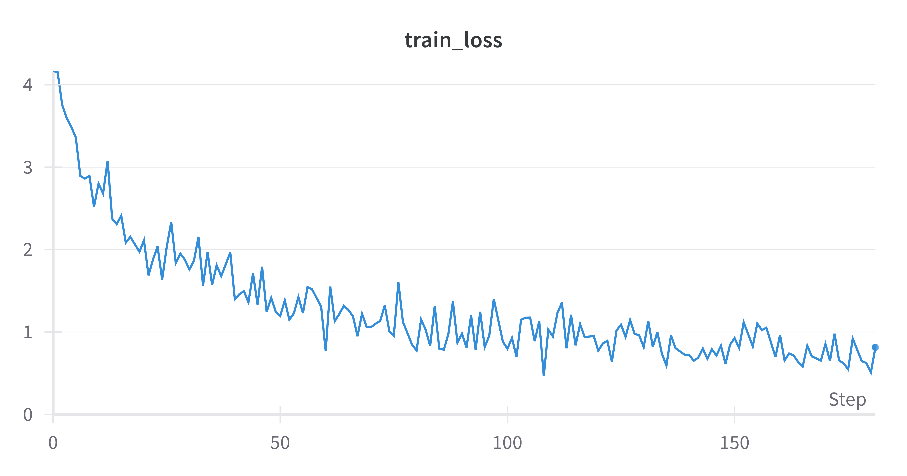
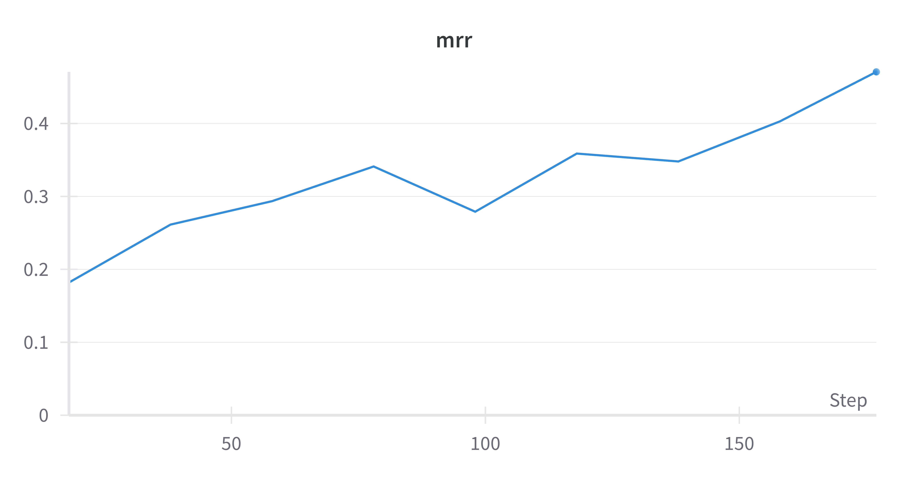
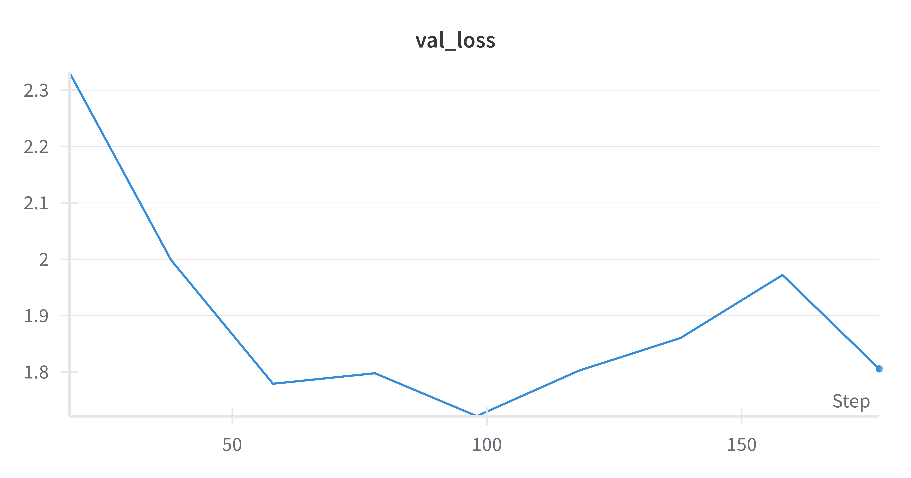

# RE2G

## 1. Installation

```bash
poetry install
```

## 2. Usage

#### Strongly recommend to create your own `.env` file and use the params as below.

```dotenv
# Optimizers
OPTIMIZER_LEARNING_RATE=1e-3
OPTIMIZER_WEIGHT_DECAY=1e-2

# Context Models
CONTEXT_MAX_LENGTH=512
CONTEXT_PADDING=max_length
CONTEXT_NUM_TRAINABLE_LAYERS=2

# Query Models
QUERY_MAX_LENGTH=512
QUERY_PADDING=max_length
QUERY_NUM_TRAINABLE_LAYERS=2

# Rerank Models
RERANK_MAX_LENGTH=512
RERANK_PADDING=max_length
RERANK_NUM_TRAINABLE_LAYERS=2

# Data module
DATAMODULE_BATCH_SIZE=8
DATAMODULE_DPR_BM25_K=8
DATAMODULE_RERANK_BM25_K=8
DATAMODULE_RERANK_DPR_K=8

# Dataloader
DATALOADER_NUM_WORKERS=0

# Trainer
TRAINER_STRATEGY=auto
TRAINER_PRECISION=32
TRAINER_MAX_EPOCHS=500
TRAINER_LIMIT_VAL_BATCHES=1e-0
TRAINER_LIMIT_TRAIN_BATCHES=1e-0
TRAINER_LIMIT_TEST_BATCHES=1e-0

# Checkpoint
CHECKPOINT_EVERY_N_TRAIN_STEPS=100
CHECKPOINT_DIRPATH=checkpoints
CHECKPOINT_MONITOR=mrr
CHECKPOINT_MODE=max
CKPT_PATH=last

# Training Model Target
# available value is 'dpr' or 'rerank'
TRAINING_MODEL=rerank

RERANK_LOSS_TYPE=mpnl

```

#### Log-in to wandb before training the model.

```bash
wandb login
```

#### Run the following command to train the model.

```bash
# which python
python train.py
```
- make sure to use the correct python version, if you have multiple python versions installed.

## 3. Training Result

#### 8 Epoch results images are as below. (Not yet done)
#### Apparently, our living room has been mistaken for a runway, thanks to the airplane-like noise levels during my training sessions. My wife filed a playful complaint, effectively grounding my progress.


- The training loss is expected to converge around the level of 0.5.


- Among 64 batches, it ranks on average within the top 2.
- Currently, based on the results at 8 epochs, additional training is anticipated to further improve the metrics.


- It seems necessary to observe further to determine whether the validation loss will converge.
